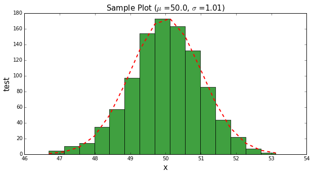

# img2ppt

Simple function to save images in a directory one by one to a PowerPoint presentation

# dependancies
You will need [Python PPTX](https://python-pptx.readthedocs.org/en/latest/)
# example

The image below is saved twice in this repo.

Use the test() function to write it to test.pptx

